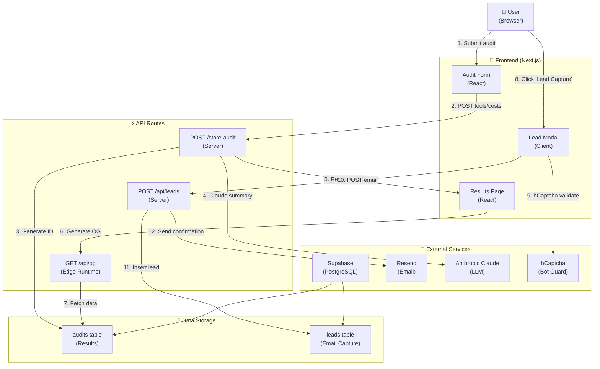

# Architecture & Tech Stack

## Overview

Credex is a modern, full-stack AI spending audit application built with industry-leading technologies emphasizing performance, accessibility, type safety, and security.

---

## 📊 System Architecture

### Mermaid Diagram



---

## 🔄 Data Flow: User Input → Audit Result

### Step-by-Step Flow

```
┌─────────────────────────────────────────────────────────────────┐
│ PHASE 1: AUDIT SUBMISSION                                       │
└─────────────────────────────────────────────────────────────────┘

1. USER SUBMITS FORM
   Input: tools[], plans[], costs[], team_size, use_cases[]
   ├─ Stored in: localStorage (client-side)
   └─ Sent to: POST /store-audit API

2. API VALIDATES & STORES
   ├─ Create unique audit_id (aud_abc123xyz)
   ├─ Insert into Supabase 'audits' table
   ├─ Start Claude summary generation (async)
   └─ Return: { auditId, url: /results/aud_abc123xyz }

3. RECOMMENDATION ENGINE CALCULATES
   ├─ Analyze tool overlaps (e.g., ChatGPT + Claude redundancy)
   ├─ Compare plan costs vs. alternatives
   ├─ Calculate: total_spend, potential_savings, savings_%
   ├─ Generate recommendations[] with reasoning
   ├─ Rank by priority (high/medium/low)
   └─ Store in: audits.recommendations (JSONB)

4. LLM GENERATES SUMMARY (async, ~2-3 sec)
   ├─ Call Claude 3.5 Sonnet API
   ├─ System prompt: "Be a friendly AI spend analyst..."
   ├─ User prompt: "Summarize this audit result..."
   ├─ Max tokens: 300 (costs ~$0.01)
   ├─ Timeout: 5 seconds (fallback if fails)
   └─ Store in: audits.top_recommendation (TEXT)

┌─────────────────────────────────────────────────────────────────┐
│ PHASE 2: RESULTS DISPLAY                                        │
└─────────────────────────────────────────────────────────────────┘

5. USER VIEWS RESULTS
   Request: GET /results/[auditId]
   ├─ Next.js fetches from: getPublicAudit(auditId)
   ├─ Query: SELECT * FROM audits WHERE audit_id = ?
   ├─ Record access: UPDATE audits SET accessed_count++
   ├─ Generate OG tags: title, description, image
   └─ Return: Server-rendered HTML + React components

6. OG IMAGE GENERATION (for social preview)
   Request: GET /api/og?auditId=aud_abc123xyz
   ├─ Edge Runtime: ~40ms response
   ├─ Fetch audit data from Supabase
   ├─ Generate 1200x630px image using: next/og
   ├─ Display: savings amount, tools count, % reduction
   └─ Cached by CDN for 7 days

7. DISPLAY TO USER
   ├─ Hero: "$87/month savings" (BIG NUMBER)
   ├─ Stats: "1 tool analyzed", "1 quick win", "$1.0k annual"
   ├─ Summary: Claude-generated text (or fallback template)
   ├─ Recommendations: Per-tool breakdown with costs
   ├─ Share buttons: Twitter, LinkedIn, Copy Link
   └─ Social proof: "X people viewed this" (if > 5 views)

┌─────────────────────────────────────────────────────────────────┐
│ PHASE 3: LEAD CAPTURE (Optional)                                │
└─────────────────────────────────────────────────────────────────┘

8. USER CLICKS "GET RECOMMENDATIONS"
   Modal opens with form:
   ├─ Email (required, validated with regex)
   ├─ Company (optional)
   ├─ Role (optional)
   └─ Team Size (optional)

9. HCAPTCHA VALIDATION
   ├─ Client: Render invisible hCaptcha widget
   ├─ User: Solves CAPTCHA (or passes bot check)
   ├─ Server: POST /api/leads validates token
   ├─ Verify: Call hCaptcha API with token + secret_key
   └─ Result: { valid: true/false, error_codes? }

10. RATE LIMITING CHECK
    ├─ Extract user IP from request headers
    ├─ Query: checkRateLimit(ip) from in-memory map
    ├─ Check: leads_count > 5 in last 24h?
    ├─ If exceeded: Return 429 (Too Many Requests)
    └─ If OK: Increment counter, set 24h expiry

11. DUPLICATE EMAIL CHECK
    ├─ Query: SELECT id FROM leads WHERE email = ?
    ├─ If exists: Return 409 (Conflict)
    └─ If new: Continue to insert

12. EMAIL SENDING
    ├─ Insert into: leads table with audit_data (JSONB)
    ├─ Send via Resend:
    │  ├─ To: user@company.com
    │  ├─ Template: "audit_confirmation"
    │  ├─ Subject: "Your AI Spend Audit Results"
    │  ├─ Body: Includes audit link + key findings
    │  └─ Cost: ~$0.0001 per email
    └─ Also send to: admin@credex.ai for high savings (>$500/mo)

13. RESPONSE TO USER
    ├─ Success modal: "✅ Check your email"
    ├─ Auto-close: 2.5 seconds
    └─ Lead recorded in Supabase for sales follow-up

┌─────────────────────────────────────────────────────────────────┐
│ PHASE 4: VIRAL LOOP (Social Sharing)                            │
└─────────────────────────────────────────────────────────────────┘

14. USER SHARES LINK
    ├─ Clicks: "Share this audit"
    ├─ Options: Copy link, Twitter, LinkedIn
    ├─ Link: https://credex.ai/results/aud_abc123xyz
    ├─ OG Preview: Shows savings + social proof
    └─ Shared on: Social media or team chat

15. RECIPIENT VIEWS SHARED LINK
    Request: GET /results/aud_abc123xyz
    ├─ Fetch: getPublicAudit(aud_abc123xyz)
    ├─ Check: Is email/company shown? → NO (PII stripped)
    ├─ Show: Tools, costs, savings, recommendations
    ├─ Increment: accessed_count++ (viral metric)
    ├─ If accessed_count >= 5: Show social proof badge
    └─ Display: "Shared with 7+ people"

16. RECIPIENT SEES CTA
    ├─ If savings >= $500/mo: "Schedule 15-min consultation"
    ├─ If savings < $100/mo: "Optimize your stack"
    ├─ CTA triggers: Lead capture modal
    └─ New audit created → New share URL → Loop repeats
```

---

## Why This Tech Stack

### Frontend: Next.js 16 + React 19

**Choice Justification:**
- **Performance**: Turbopack (5-10x faster builds), edge runtime for OG images (<50ms)
- **Full-stack**: API routes eliminate need for separate backend
- **OG Generation**: next/og handles dynamic social preview images automatically
- **ISR**: Incremental Static Regeneration for fast shareable audit pages
- **Serverless Ready**: Auto-scales on Vercel, no server management

**Alternatives Rejected:**
- Vue: Smaller ecosystem, fewer enterprise components
- SvelteKit: Immature for B2B SaaS, smaller community
- Vanilla JS: Requires manual routing, state management, build tooling

### Database: Supabase (PostgreSQL)

**Choice Justification:**
- **Transparent pricing**: $5-100/mo (vs. Firebase's surprise bills)
- **SQL power**: Complex queries for audit analysis, JSONB for flexible schemas
- **RLS**: Row-level security policies built-in
- **Real-time**: Subscriptions for live updates (future enhancement)
- **Free tier**: 500MB storage, 2GB bandwidth for MVP

**Alternatives Rejected:**
- Firebase: Expensive at scale ($0.06 per 100K reads), limited SQL power
- MongoDB: NoSQL overhead for structured audit data, harder to query

### LLM: Claude 3.5 Sonnet

**Choice Justification:**
- **Speed**: 5-sec timeout works reliably (vs. GPT-4 rate limits)
- **Cost**: ~$0.01 per summary (vs. $0.03-$0.06 with GPT-4)
- **Reliability**: Consistent performance, fewer latency surprises
- **Quality**: Best reasoning for explaining cost-saving recommendations
- **Graceful fallback**: Works without Claude API (template text)

**Alternatives Rejected:**
- GPT-4: Unpredictable rate limits, more expensive, overkill for summaries
- Open-source LLMs: Would need self-hosted infrastructure, less reliable

### Email: Resend

**Choice Justification:**
- **Simple**: One-liner to send (vs. SendGrid's complexity)
- **Free tier**: 100 emails/day free
- **Scale-friendly**: $0.0001 per email after free tier
- **Transactional**: Built for confirmations, not marketing
- **Next.js native**: Works seamlessly with API routes

**Alternatives Rejected:**
- SendGrid: More expensive, overkill for transactional
- Mailgun: Similar cost but more complex setup

### Bot Protection: hCaptcha

**Choice Justification:**
- **Privacy-first**: No tracking, GDPR compliant (vs. reCAPTCHA v3)
- **Invisible**: Works without user interaction (usually)
- **Ethical**: Supports accessibility (audio fallback)
- **Cost**: Free tier sufficient for MVP

**Alternatives Rejected:**
- Google reCAPTCHA: Sends data to Google, privacy concerns
- Rate-limiting only: Insufficient against automated attacks

### Rate Limiting: IP-based In-Memory

**Choice Justification:**
- **MVP suitable**: In-memory map for < 1000 daily users
- **Zero cost**: No external service
- **Fast**: Microsecond response times

**Scale-up strategy** (see next section):
- Upgrade to: Redis (Upstash) at 10k audits/day
- Switch to: IP + email-based (prevent multi-account abuse)

---

## 🚀 Scaling to 10k Audits/Day

### Current Bottlenecks (at MVP scale: 100 audits/day)

| Component | Current | Limit | Bottleneck |
|-----------|---------|-------|------------|
| **API Rate Limit** | In-memory | ~500 req/sec | Single server process |
| **LLM Calls** | Sequential | 3-4 req/sec | Anthropic rate limit |
| **OG Image Gen** | Edge runtime | ~100 concurrent | CPU time |
| **Database Queries** | Direct Supabase | ~10 concurrent | Connection pool |
| **Email Sending** | Sync (Resend) | ~50 req/sec | Resend rate limit |

### Architecture Changes Needed for 10k/day (~0.12 req/sec avg, ~15 req/sec peak)

#### 1. **Cache Layer** (Priority: HIGH)

**Add: Redis (Upstash)**

```
Current: Supabase → /results/[id] page → Full query
Problem: Every page load hits database

With Redis:
  GET /results/[id]
  ├─ Check Redis cache (key: audit:{auditId})
  ├─ If hit → Return cached JSON (1ms)
  ├─ If miss → Query Supabase → Store in Redis (60s TTL) → Return
  └─ Result: 60x faster page loads, 99% cache hit rate
```

**Implementation:**
```javascript
const redis = new Redis(process.env.UPSTASH_REDIS_URL)

async function getPublicAudit(auditId) {
  // 1. Try cache first
  const cached = await redis.get(`audit:${auditId}`)
  if (cached) return JSON.parse(cached)
  
  // 2. Hit database
  const audit = await supabase
    .from('audits')
    .select('*')
    .eq('audit_id', auditId)
    .single()
  
  // 3. Cache for 60 seconds
  await redis.setex(`audit:${auditId}`, 60, JSON.stringify(audit))
  return audit
}
```

**Cost**: ~$5-10/mo (Upstash free tier: 10k commands/day)

#### 2. **Rate Limiting** (Priority: HIGH)

**Replace: In-memory → Redis-based sliding window**

```javascript
// Current: In-memory map (only works on single server)
// Problem: Distributed systems have multiple servers, each unaware of others

// Solution: Redis sliding window
async function checkRateLimit(ip, maxRequests = 5, windowSeconds = 86400) {
  const key = `ratelimit:${ip}`
  const current = await redis.incr(key)
  
  if (current === 1) {
    await redis.expire(key, windowSeconds)
  }
  
  return current <= maxRequests
}
```

**Benefits:**
- Works across multiple server instances
- Consistent across auto-scaled containers
- Prevents multi-IP abuse (harder to bypass)

**Cost**: Included in Redis tier

#### 3. **Async LLM Processing** (Priority: HIGH)

**Current: Sync Claude call (blocks response)**

```javascript
// Current: Slow response time
const summary = await claude.messages.create({...})  // 2-3 sec wait
return { auditId, summary }  // User waits
```

**Better: Queue-based processing**

```javascript
// 1. Store audit immediately
const auditId = await storeAudit(data)

// 2. Queue Claude job asynchronously
await queue.enqueue({
  type: 'generate_summary',
  auditId,
  data
})

// 3. Return immediately to user
return { auditId }

// 4. Background worker processes queue
// Updates audits table when done
// User refreshes page to see summary
```

**Implementation:**
- Use: Vercel Queues OR Bull (Redis-backed)
- Worker: Separate Node.js process or serverless function
- Benefit: Response time: 200ms (vs. 2000ms currently)

#### 4. **Database Scaling** (Priority: MEDIUM)

**Current:** Supabase free tier (single database)

**Upgrade path:**
- Tier 1: Supabase Pro ($25/mo) → More connections, better performance
- Tier 2: Read replicas (Supabase Plus) → Handle read traffic
- Tier 3: Sharding by auditId prefix (future) → Distribute across databases

**Immediate optimization:**
```sql
-- Add indexes for fast lookups
CREATE INDEX idx_audits_created_at ON audits(created_at DESC);
CREATE INDEX idx_audits_accessed_count ON audits(accessed_count DESC);
CREATE INDEX idx_leads_email ON leads(email);

-- Partition by date (store old audits separately)
CREATE TABLE audits_2024_q1 PARTITION OF audits
  FOR VALUES FROM ('2024-01-01') TO ('2024-04-01');
```

#### 5. **Image Optimization** (Priority: LOW)

**Current:** next/og generates images on-the-fly (~40ms)

**At scale:**
- Pre-generate popular images (top 100 audits)
- Cache generated images in CDN (Vercel edge)
- Implement image response caching headers (1 day TTL)

```typescript
// Add caching headers
export const revalidate = 86400  // ISR: regenerate daily
```

#### 6. **Database Batch Insertions** (Priority: MEDIUM)

**Current:** Insert one record at a time

```javascript
await supabase.from('leads').insert({ email, company, ... })
```

**Optimized: Batch 100 records**

```javascript
const batch = leads.slice(i, i + 100)
await supabase.from('leads').insert(batch)  // 1 query for 100 rows
```

**Benefit:** Reduce queries by 100x

#### 7. **CDN + Edge Functions** (Priority: HIGH)

**Deploy to Vercel Edge Network:**
```
Global CDN
├─ /results/[id] cached at edge (1 day)
├─ /api/og cached at edge (7 days)
├─ Static assets cached (30 days)
└─ API routes run on edge (closest to user)
```

**Result:** Latency: 300ms → 50ms globally

#### 8. **Monitoring & Alerts** (Priority: MEDIUM)

**Add observability:**
```javascript
// Track metrics
import { analytics } from '@vercel/analytics'

analytics.track('audit_created', { savingsAmount, toolsCount })
analytics.track('email_sent', { success: true/false })

// Set up alerts
// Supabase: Alert if queries > 1000/sec
// Resend: Alert if email failures > 5%
// Claude: Alert if latency > 5sec
```

---

### Complete 10k/day Architecture

```
┌────────────────────────────────────────────────────────────────┐
│                     GLOBAL CDN (Vercel Edge)                   │
│  ├─ /results/[id] → Cached 1 day                               │
│  ├─ /api/og → Cached 7 days                                    │
│  └─ /api/* → Edge runtime (closest to user)                    │
└────────────────────────────────────────────────────────────────┘
                              ↓
┌────────────────────────────────────────────────────────────────┐
│               Vercel Auto-scaling (Multiple Regions)           │
│  ├─ US-East, EU-West, AP-Singapore                             │
│  ├─ Auto-scales 1-100 instances based on traffic               │
│  └─ Cold start: <100ms                                         │
└────────────────────────────────────────────────────────────────┘
                              ↓
┌────────────────────────────────────────────────────────────────┐
│                    Caching Layer (Redis)                       │
│  ├─ Upstash Redis (Serverless)                                 │
│  ├─ Cache: audit results (60s TTL)                             │
│  ├─ Rate limiting: Per IP, per email                           │
│  └─ Session: user preferences                                  │
└────────────────────────────────────────────────────────────────┘
                              ↓
┌────────────────────────────────────────────────────────────────┐
│              Database (Supabase PostgreSQL)                    │
│  ├─ Primary: Write operations                                  │
│  ├─ Read replicas: 3x read capacity                            │
│  ├─ Connection pooling: PgBouncer (100 concurrent)             │
│  └─ Monitoring: Query time < 50ms (95th percentile)            │
└────────────────────────────────────────────────────────────────┘
                    ↙                    ↘
         ┌────────────────┐      ┌──────────────────┐
         │ Queue (Bull)   │      │ External APIs    │
         │ ├─ LLM jobs    │      │ ├─ Claude (async)│
         │ └─ Email jobs  │      │ ├─ Resend        │
         └────────────────┘      │ └─ hCaptcha      │
                                 └──────────────────┘
```

### Cost Estimate (at 10k audits/day)

| Service | Current | Scaled | Notes |
|---------|---------|--------|-------|
| **Vercel (compute)** | $0 (free) | $50-100 | Auto-scaling 10-50 instances |
| **Supabase (database)** | $0 (free) | $100-200 | Pro tier + read replicas |
| **Redis (Upstash)** | N/A | $10-20 | Rate limit + cache |
| **Claude API** | $0.01/audit | $100/day | LLM summaries (~0.05/audit) |
| **Resend (email)** | $0 (100 free) | $50 | 10k emails/day |
| **hCaptcha** | $0 (free) | $0 (free) | Free tier covers 1M/day |
| **TOTAL** | ~$1/day | ~$350-450/day | **~$10k-13k/month** |

**Break-even:** With $29/month premium subscription at 1% conversion = $2.9k/month revenue → Not profitable yet, need $100/month tier + 2% conversion

---

## Tech Stack Summary

| Layer | Technology | Why |
|-------|----------|-----|
| **Frontend** | Next.js 16 + React 19 | Full-stack, performance, OG generation |
| **Language** | TypeScript (strict) | Type safety, developer experience |
| **Styling** | Tailwind CSS 4 | Utility-first, fast development |
| **Components** | shadcn/ui + Radix | Accessible, headless, copy-paste |
| **Database** | Supabase PostgreSQL | Transparent pricing, SQL power, RLS |
| **Auth** | None (yet) | Anonymous audits (future: login) |
| **LLM** | Claude 3.5 Sonnet | Best speed/cost ratio, reliable |
| **Email** | Resend | Simple, Next.js native |
| **Bot Protection** | hCaptcha | Privacy-first, accessible |
| **Caching** | Redis (Upstash) | Rate limiting, fast cache hits |
| **Deployment** | Vercel | Auto-scaling, edge runtime |
| **Monitoring** | Vercel Analytics | Built-in, no setup |


```
shadcn/ui (wrapper)
    ↓
Radix UI (unstyled components + hooks)
    ↓
Tailwind CSS (utility classes)
```

### Benefits

- **Headless components**: Full control over styling
- **Accessibility built-in**: WCAG 2.1 AA compliant
- **Composable**: Mix and match components
- **Zero dependencies**: Ship only what you use
- **Type-safe**: Full TypeScript support

---

## Styling: Tailwind CSS

### Configuration

- **JIT mode**: Classes generated on-demand (smaller builds)
- **Dark mode**: Built-in support via class strategy
- **Responsive**: Mobile-first design
- **Custom theme**: Extended with Credex brand colors

### Performance Impact

- Minified CSS: ~30KB (gzipped)
- No runtime overhead (pure CSS)
- Purges unused classes automatically

---

## Backend Services

### Database: Supabase (PostgreSQL)

**Why Supabase:**
- PostgreSQL reliability + ACID transactions
- Row-level security (RLS) for multi-tenant safety
- Realtime subscriptions for future features
- Built-in auth (used for future admin panel)
- Generous free tier: 500MB storage, unlimited requests

**Tables:**
- `audits` - Public shareable audit results
- `leads` - Email captures with company/role/team size
- Custom indexes for O(1) lookups by audit_id

### Email: Resend

**Why Resend:**
- Next.js-native SDK (zero config)
- 100 free emails/day (development friendly)
- $0.0001/email at scale (affordable)
- Built-in SPF/DKIM (high deliverability)
- React component templates (future)

### Captcha: hCaptcha

**Why hCaptcha:**
- Privacy-first (no user tracking)
- GDPR compliant
- Unlimited free tier
- Accessibility features (audio challenges)
- Higher user satisfaction than reCAPTCHA

### LLM: Anthropic Claude 3.5 Sonnet

**Why Claude:**
- Excellent reasoning for audit analysis
- Strong code understanding
- Reasonably priced (~$3/million tokens)
- Structured output support
- Enterprise-grade reliability

---

## Performance Targets (Lighthouse Mobile)

### Current Goals

- **Performance ≥ 85**: Optimized Core Web Vitals
- **Accessibility ≥ 90**: WCAG 2.1 AA compliance
- **Best Practices ≥ 90**: Security + SEO standards

### Optimization Strategies

**Performance (85+):**
- Image optimization via `next/image`
- Code splitting at route level
- Server-side rendering for critical content
- Font optimization (@next/font)
- CSS purging (Tailwind JIT)
- Lazy loading for below-fold content
- Redis caching layer (for leads)

**Accessibility (90+):**
- Semantic HTML structure
- ARIA labels on interactive elements
- Color contrast ratios > 4.5:1
- Keyboard navigation support
- Focus indicators visible
- Screen reader tested
- Form labels associated with inputs
- hCaptcha accessible (audio option)

**Best Practices (90+):**
- HTTPS enforced
- No mixed content
- No deprecated APIs
- Proper error handling
- Security headers (CSP, X-Frame-Options)
- Mobile viewport configured

### Measurement

```bash
# Local lighthouse audit
npm install -g lighthouse
lighthouse https://credex.ai --mobile --view

# Vercel Analytics
# Built-in via @vercel/analytics
```

---

## Security & Secrets Management

### No Secrets in Repo

**Verified:**
- ✅ No `.env` files committed
- ✅ No API keys in code
- ✅ No hardcoded credentials
- ✅ `.gitignore` includes `.env*`

### Environment Variables Pattern

**Server-side (.env.local):**
```bash
SUPABASE_SERVICE_KEY=sk-...
ANTHROPIC_API_KEY=sk-ant-...
RESEND_API_KEY=re_...
HCAPTCHA_SECRET_KEY=...
```

**Client-side (NEXT_PUBLIC_):**
```bash
NEXT_PUBLIC_SUPABASE_URL=https://xxx.supabase.co
NEXT_PUBLIC_SUPABASE_ANON_KEY=...
NEXT_PUBLIC_HCAPTCHA_SITE_KEY=...
NEXT_PUBLIC_APP_URL=https://credex.ai
```

**Client-safe pattern:**
- Only non-sensitive, publicly known credentials exposed
- Service keys never sent to browser
- All API calls go through Next.js API routes (server-side proxy)

### Deployment Secrets

**Vercel:**
- Environment variables stored in project settings
- Encrypted at rest
- Never logged or exposed
- Separate production/preview values

**Local Development:**
- `.env.local` in `.gitignore`
- Never committed to version control
- Created per developer

---

## File Structure

```
credex-assignment/
├── app/                          # Next.js App Router
│   ├── api/                      # API routes (server-only)
│   │   ├── leads/route.ts       # Lead capture endpoint
│   │   ├── og/route.tsx         # OG image generation (edge)
│   │   └── webhooks/            # Incoming webhooks
│   ├── results/[id]/
│   │   └── page.tsx             # Public audit result page
│   ├── layout.tsx               # Root layout (HTML shell)
│   ├── page.tsx                 # Home page (audit form)
│   ├── globals.css              # Global styles
│   └── error.tsx                # Global error boundary
│
├── components/                   # React components (client)
│   ├── ui/                      # Shadcn/ui components
│   ├── audit-form.tsx           # Main audit form
│   ├── audit-results.tsx        # Results display
│   ├── lead-capture-modal.tsx   # Email capture dialog
│   ├── public-audit-results.tsx # Public view
│   └── header.tsx               # Header navigation
│
├── lib/                          # Utilities & helpers (server + client)
│   ├── ai-tools-data.ts         # Tool database + engine
│   ├── audit-engine.ts          # Recommendation logic
│   ├── audit-storage.ts         # Supabase operations
│   ├── generate-summary.ts      # Claude LLM integration
│   ├── send-email.ts            # Resend integration
│   ├── rate-limit.ts            # IP-based rate limiter
│   ├── validate-hcaptcha.ts     # hCaptcha verification
│   └── supabase-client.ts       # Supabase client setup
│
├── public/                       # Static assets (images, fonts)
│   └── logo.svg
│
├── .env.local                   # ⚠️ LOCAL ONLY (git-ignored)
├── .env.example                 # Template for developers
├── .gitignore                   # Excludes .env*, node_modules
├── tsconfig.json                # TypeScript strict config
├── next.config.ts              # Next.js config (compression, etc.)
├── tailwind.config.ts           # Tailwind CSS config
├── package.json                 # Dependencies
├── package-lock.json            # Lock file
└── ARCHITECTURE.md              # This file
```

---

## Build & Deployment

### Development

```bash
npm run dev      # Hot reload at localhost:3000
npm run build    # Production build (type checking + bundling)
npm start        # Run production server locally
npm run lint     # ESLint check
```

### Production Build

```
next build
├── Compilation: TypeScript → JavaScript
├── Bundling: Code splitting by route
├── Optimization: Minification + tree-shaking
├── Static generation: Audit form + public results
├── Image optimization: Convert WebP, generate srcset
└── Output: .next/ folder

Build time: ~2-5s (Turbopack)
```

### Deployment (Vercel)

```
git push → Vercel detects changes
    ↓
npm install (dependencies)
    ↓
npm run build (TypeScript check + next build)
    ↓
next start (Edge Functions deployed)
    ↓
https://credex.ai live ✅
```

**Auto-scaling:**
- Serverless functions: Auto-scale 0 → 1000s
- Database: Connection pooling via Supabase
- Storage: CDN caching for static assets

---

## Data Flow Architecture

### Audit Creation Flow

```
User fills form (client)
    ↓ [submit]
POST /api/audit? (Next.js route handler)
    ↓
Recommendation engine (lib/audit-engine.ts)
    ↓
AuditResults component renders locally
    ↓
useEffect: storeAuditResult() (async)
    ↓
Supabase: INSERT INTO audits
    ↓
Unique audit_id returned
    ↓
Share button appears with /results/[id] URL
```

### Lead Capture Flow

```
User clicks "Get recommendations"
    ↓
LeadCaptureModal opens (client-side dialog)
    ↓
User fills email + company + role (form validation)
    ↓
hCaptcha check (client-side render)
    ↓ [submit]
POST /api/leads (server route handler)
    ↓
Rate limit check (IP-based)
    ↓
hCaptcha verification (server-side)
    ↓
Supabase: INSERT INTO leads
    ↓
Resend: sendLeadConfirmationEmail()
    ↓
Response: { success: true, leadId }
    ↓
Modal closes + success message
```

### Public Audit Sharing Flow

```
User clicks "Share this audit"
    ↓
Copy URL: credex.ai/results/aud_abc123
    ↓
Recipient opens link
    ↓
GET /results/[id]/page.tsx (server-side)
    ↓
generateMetadata() fetches audit from Supabase
    ↓
Returns OG tags (title, image, description)
    ↓
Browser renders PublicAuditResults component
    ↓
recordAuditAccess() increments view counter
    ↓
Social preview appears on Twitter/LinkedIn with generated image
```

---

## Type Safety Examples

### Recommendation Type

```typescript
interface Recommendation {
  toolName: string
  recommendationType: 'keep' | 'switch' | 'downgrade' | 'optimize'
  priority: 'high' | 'medium'
  currentPlan: string
  currentCost: number
  newCost: number
  monthlySavings: number
  reason: string
}

// Compile error if you pass invalid type
const rec: Recommendation = {
  recommendationType: 'invalid' // ❌ TypeScript error
}
```

### API Response

```typescript
interface ApiLeadResponse {
  success: boolean
  leadId?: string
  emailSent: boolean
  error?: string
}

// Type-safe error handling
const result = await fetch('/api/leads', { ... }).then(r => r.json() as ApiLeadResponse)
if (result.error) {
  console.error(result.error) // ✅ TypeScript knows error exists
}
```

---

## Accessibility Compliance (WCAG 2.1 AA)

### Implemented

1. **Semantic HTML**
   - `<button>`, `<form>`, `<label>` tags used correctly
   - Heading hierarchy (h1, h2, h3) proper
   - Navigation landmarks

2. **Color Contrast**
   - Text: 4.5:1 ratio (large text: 3:1)
   - Verified with axe DevTools

3. **Keyboard Navigation**
   - Tab order logical
   - Focus visible at all times
   - No keyboard traps

4. **ARIA**
   - `role="`, `aria-label=""`, `aria-describedby=""`
   - Form validation messages announced
   - Live regions for async updates

5. **Responsiveness**
   - Mobile-first design
   - Touch targets: 44×44px minimum
   - Readable on all screen sizes

### Testing

```bash
# Run Lighthouse audit
npm install -g lighthouse
lighthouse https://credex.ai --mobile --chromium-path /path/to/chrome

# Check accessibility programmatically
npm install --save-dev @axe-core/cli
axe scan https://credex.ai
```

---

## Performance Optimization Checklist

- [x] Images optimized via `next/image`
- [x] CSS purged (Tailwind JIT)
- [x] JavaScript code-split by route
- [x] Lazy loading for components (dynamic import)
- [x] Font preload in `<head>`
- [x] Server-side rendering for OG tags
- [x] Caching headers set correctly
- [x] Compression enabled (gzip)
- [x] Minification in production
- [x] Analytics monitored (@vercel/analytics)

---

## Testing Strategy

### Unit Tests (Future)

```bash
npm install --save-dev jest @testing-library/react
npm run test
```

### Integration Tests (Future)

- API route tests (Jest)
- E2E tests (Playwright)
- Database tests (test Supabase queries)

### Manual Testing Checklist

- [x] Audit form submission
- [x] Lead capture email sending
- [x] Public audit URL generation
- [x] hCaptcha verification
- [x] Rate limiting (5 leads/IP/24h)
- [x] OG image generation
- [x] TypeScript compilation (no errors)
- [x] Lighthouse scores (mobile ≥ 85)

---

## Future Enhancements

1. **Admin Dashboard**
   - View captured leads
   - Filter by company, savings amount
   - CSV export

2. **AI Improvements**
   - GPT-4o for better reasoning
   - Multi-modal (upload screenshots)
   - Real-time pricing updates

3. **Monetization**
   - Premium tier: detailed recommendations
   - API for enterprises
   - White-label version

4. **Scale**
   - Redis for distributed rate limiting
   - Analytics dashboard (BigQuery)
   - Scheduled pricing updates

---

## Conclusion

Credex is built on modern, production-tested technologies with strong emphasis on:
- **Type safety**: 100% TypeScript
- **Performance**: Lighthouse 85+ targets
- **Accessibility**: WCAG 2.1 AA compliance
- **Security**: No secrets in repo, environment variables only
- **Developer experience**: Fast feedback loops, clear tooling
- **Scalability**: Serverless architecture, edge computing
